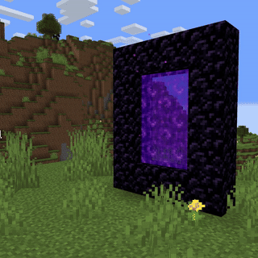
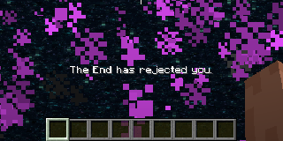
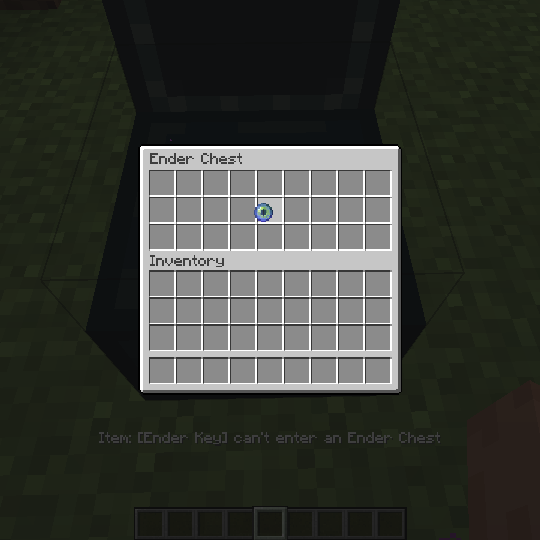

# Dimension Locker

---
## Description
This mod lets you disable any dimension (Compatible with other mods). Exceptions can be granted through custom items to let players enter locked dimension. It introduces new commands, a gamerule, and custom data components to enhance the player interactions with the permits.

## Features

1. **Locked portals**

    Whenever any entity is about to be teleported (by a portal) to a locked dimension, it would being pushed instead, also get a feedback message with the dimension's name.

    
    
    

    ---

 2. **Compatibility**

    **This mod is available in**
    - **Forge**
    - **NeoForge**
    - **Fabric**
    - ***Quilt***

    Works out of the box with any other mod that adds dimensions, however you still need some language compatibility. 
    you will need a resource pack to add a language key,
    ```dimension.<mod_id>.<dimension_name>```

    in the case of the nether dimension the mod has ```"dimension.minecraft.the_nether": "The Nether",```

    ---

3. **Data Components**

    Here are a couple of **Data Components** added by the mod that are **recommended** to use **all together**, but can be used separately if desired.

    - **`dimension`:**\
        whenever an entity has a item with the `dimension` data component, no matter if the dimension is trying to enter is locked, it will enter as long as the component's dimension matches the one trying to enter.
        
        Example:\
        `/give @s minecraft:ender_eye[dimension_locker:dimension="minecraft:the_end"]`
  
    - **`cant_enter_ender_chest`:**

        Doesn't let the item inside the ender chest, nor any item containing it (shulker boxes, bundles, etc).
        

        Example: `/give @s minecraft:ender_eye[dimension_locker:cant_enter_ender_chest={}]`

    - **`un_despawnable`:**

        Quite simple, **prevents** the **item** from **despawning** after the standard **5 minutes**, can be paired with the `damage_resistant` data component to make undestructible items.

    ---

4. **Commands**

    You don't have to reboot your server to lock a dimension, an admin can use one of these commands, and it the dimension would be locked/unlocked right away. 

   - Lock Command: `/dimension lock <dimension>`
   - Unlock Command: `/dimension unlock <dimension>`
   - Check Command: `/dimension isLocked <dimension>`\
    Operators can check the locked status of a dimension.

    ---

5. **New Gamerule**

    `operatorCanEnterLockedDimension`: A gamerule that determines whether operators can bypass locked dimensions. Set to true by default.

    ---
